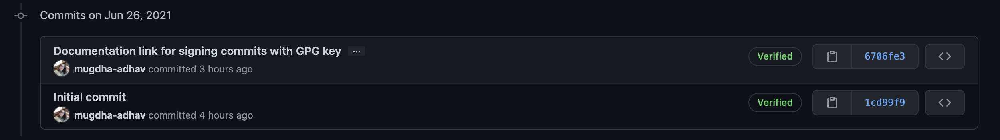

## Signing GIT commits with GPG key

### Why sign commits?
When we push commits to Git without signing them, the only source of truth who pushed the commit is the user-name and the email address. But anyone can easily update both of these fields for the existing commits, or push commits with fake details.

Commit signing helps you verify that commits are actually coming from a trusted source. If you are working on sensitive code or in the open source world, it's crucial to verify commiter's signature and also not allowing anyone to modify your commits.

### How to sign commits?
Follow [this](https://docs.github.com/en/github/authenticating-to-github/managing-commit-signature-verification) guide for setting up the GPG key and managing commit signature verification.

Once the commit signature verification is setup successfully, your commits should be tagged with the `verified` keyword.



You can also append a signing-off message in the Git commit message with the `-s` or `--signoff` flag.


### Things to note
1. `-s` or `--signoff` flag in the git commit command stands for adding a signing-off message, whereas`-S` or `--gpg-sign` stands for GPG signing a message.
2. You can use `git log --show-signature` to check the signatures of the commits.

### Issues
After setting up commit signatures, if you get an error saying -
```
error: gpg failed to sign the data
fatal: failed to write commit object
```
Then, add the below line in your .zshrc or .bashrc
```
export GPG_TTY=$(tty)
```
